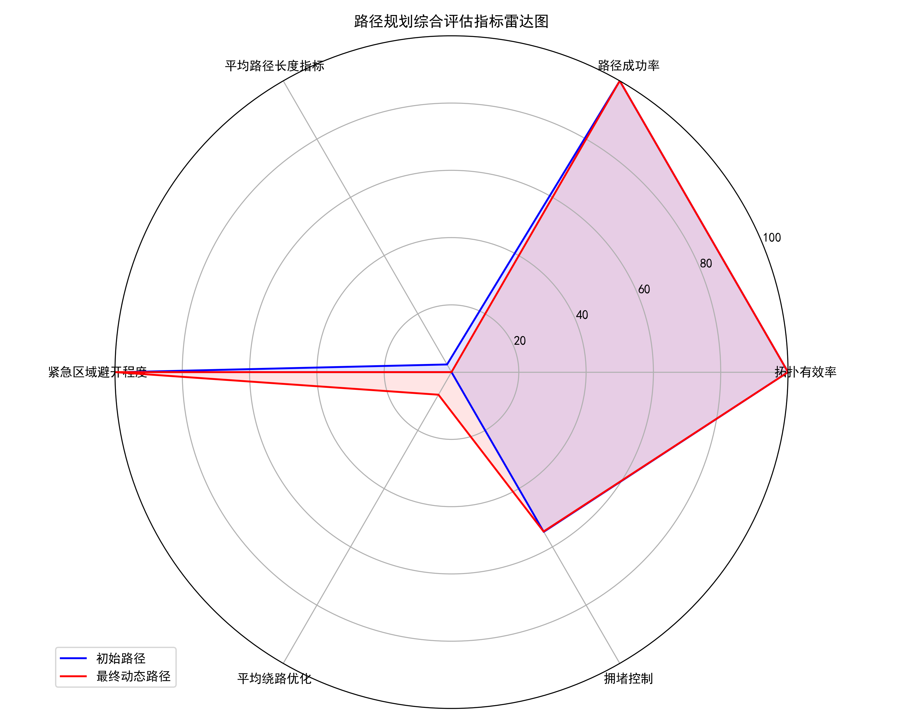
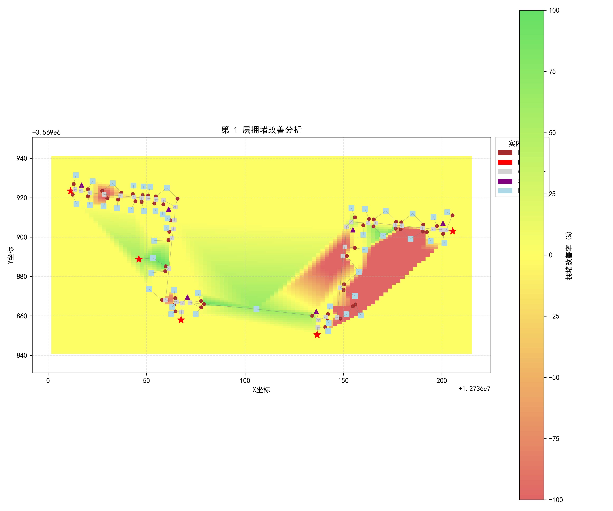
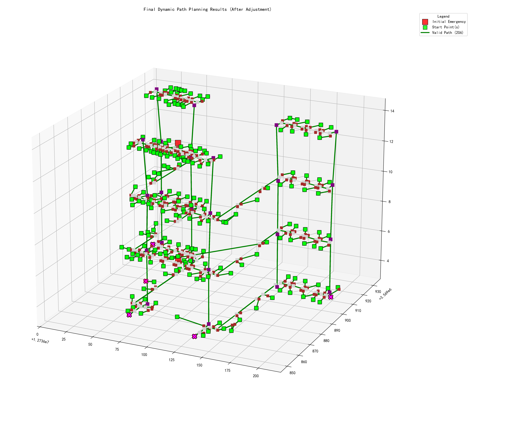

# 神经网络路径规划系统

## 项目概述

本项目是一个基于神经网络的建筑物疏散路径规划系统，能够在紧急情况下为多楼层建筑物生成最佳疏散路径。系统利用 BP 神经网络模型学习建筑物拓扑结构特征，并能够根据紧急情况的动态变化（如火灾、拥堵）实时调整路径规划。

## 系统特点

- **多楼层支持**: 可处理复杂的多层建筑结构
- **动态规划**: 根据紧急区域位置实时调整疏散路径
- **拥堵感知**: 能够检测并避开潜在的拥堵区域
- **可视化工具**: 提供丰富的 2D/3D 拓扑可视化和路径评估图表（使用 AI 实现的有一些问题，明明加载的列表没有拓扑关系错误，但是生成的图中却像有拓扑关系错误一样？）
- **性能评估**: 全面的路径评估指标和对比分析

## 系统架构

系统由以下核心组件构成：

系统由以下核心组件构成：

1.  **疏散实体管理** ([`EvacuationEntity`](src/evacuation_entity.py))
    表示建筑物中的各类实体（房间、走廊、楼梯、出口等）

2.  **神经网络模型** ([`BPNeuralNetworkModel`](src/model.py))
    基于 PyTorch 实现的 BP 神经网络，用于学习和预测路径选择

3.  **路径生成器** ([`PathGenerator`](src/path_generation.py))
    生成训练数据和测试路径

4.  **模型训练系统** ([`PathTraining`](src/training.py))
    实现神经网络模型训练流程

5.  **拓扑与路径可视化** ([`visualize_topology.py`](visualize_topology.py), [`src/visualization.py`](src/visualization.py))
    提供建筑物拓扑结构、路径规划结果和评估指标的可视化

6.  **模型评估** ([`model_evaluation`](src/model_evaluation.py))
    评估模型性能和路径规划效果

## 环境与依赖

### 前提条件

- conda 虚拟环境下
- Python 3.9 版本
- pytorch（核心库 GPU 版本）
- 其他依赖库，使用 pip 直接安装
- 支持 CUDA 12.6 版本

### 配置步骤

1. 先使用 conda 创建一个 python3.9 的环境

```bash
conda create --name ~~~  python=3.9
```

2. 下载 pytorch（核心库 GPU 版本）

```bash
pip3 install torch torchvision torchaudio --index-url https://download.pytorch.org/whl/cu126
```

3. 其他依赖下载

```bash
pip install 需要的库
pip install numpy pandas matplotlib seaborn networkx openpyxl scipy（缺少再加）
```

## 使用方法

### 准备数据

1. 将建筑物布局数据 excel（记得经过处理后的）放入 `data/building_layout.xlsx` (参考项目中的示例格式)

### 模型训练

运行训练脚本以训练神经网络模型:

```bash
python src/training.py
```

训练过程包括:

- 生成初始训练数据
- 初始模型训练
- 自学习迭代过程
- 最终模型评估与保存

### 拓扑可视化

使用以下命令可视化建筑物拓扑结构:

```bash
python visualize_topology.py --data_file data/building_layout.xlsx --output_dir models/topology_vis
```

### 动态路径规划测试

运行动态规划测试脚本:

```bash
python src/test_dynamic_planning.py
```

### 3. 全面模型评估（有问题）

提供丰富的评估指标:

此部分旨在通过 [`src/model_evaluation.py`](src/model_evaluation.py) 中的 [`evaluate_model_performance`](src/model_evaluation.py) 函数提供全面的模型性能评估，生成包括以下指标的报告和图表。
**注意：此功能在当前版本中可能存在集成问题，如 `test_dynamic_planning.py` 中所示。**

- 拓扑有效率 ([`initial_valid_ratio`](src/model_evaluation.py), [`final_valid_ratio`](src/model_evaluation.py))
- 路径成功率 ([`initial_success_rate`](src/model_evaluation.py), [`final_success_rate`](src/model_evaluation.py))
- 平均路径长度 ([`initial_avg_length`](src/model_evaluation.py), [`final_avg_length`](src/model_evaluation.py))
- 紧急区域避开程度 ([`initial_avg_emergency_dist`](src/model_evaluation.py), [`final_avg_emergency_dist`](src/model_evaluation.py))
- 平均绕路优化 ([`initial_avg_detour`](src/model_evaluation.py), [`final_avg_detour`](src/model_evaluation.py))
- 拥堵控制 ([`initial_congestion`](src/model_evaluation.py), [`final_congestion`](src/model_evaluation.py), [`congestion_improvement`](src/model_evaluation.py))

## 输出示例

系统生成的评估可视化图表包括:

1. **综合评估雷达图**  
   

2. **拥堵改善图**  
   

3. **3D 动态路径规划**  
   

## 项目结构

```
.
├── final_trained_model.pth     # 训练好的神经网络模型
├── README.md                     # 解释文档
├── data/
│   ├── building_layout.xlsx      # 建筑物布局数据
│   └── initial_training_data.csv # 初始训练数据
├── models/                       # 模型和评估结果
│   ├── comprehensive_radar_chart.png
│   ├── congestion_improvement_*.png
│   ├── evaluation_summary_table.png
│   ├── evaluation_summary.csv
│   ├── final_trained_model.pth   # 训练好的神经网络模型（这里两个是为了备份，训练时间花费太久了，我这个是训练好的，直接用 就好了）
│   ├── final_dynamic_paths_test_3d.png
│   ├── initial_dynamic_paths_test_3d.png
│   └── topology_vis/           # 拓扑可视化输出目录
└── src/                          # 源代码
    ├── __init__.py
    ├── evacuation_entity.py    # 疏散实体类定义和数据加载
    ├── model.py                # BP神经网络模型 (PyTorch)
    ├── path_generation.py      # 初始路径生成器
    ├── training.py             # 模型训练和自学习迭代逻辑
    ├── topology_visualization.py # 拓扑图可视化类
    ├── model_evaluation.py     # 模型和路径评估函数
    ├── test_dynamic_planning.py # 动态规划测试和评估脚本
    └── visualization.py         # 提供绘图和可视化功能的模块
```

## 引用

本项目基于下面的论文：
```
@article{PENG201971,
title = {A self-learning dynamic path planning method for evacuation in large public buildings based on neural networks},
journal = {Neurocomputing},
volume = {365},
pages = {71-85},
year = {2019},
issn = {0925-2312},
doi = {https://doi.org/10.1016/j.neucom.2019.06.099},
url = {https://www.sciencedirect.com/science/article/pii/S0925231219310306},
author = {Yang Peng and Sun-Wei Li and Zhen-Zhong Hu},
keywords = {Evacuation, Path planning, Neural network, Building information modeling, Artificial intelligence},
abstract = {Evacuation path planning is of significant importance to safely and efficiently evacuate occupants inside public buildings. Current computer simulation methods carry out evacuation analysis and then provide emergency education and management with a vivid virtual environment. However, efficient evacuation path planning approaches for evacuation guidance still meet the challenges of generating the analysis models, and lacking of real-time analysis methods under dynamic circumstances. In this study, a dynamic path planning approach based on neural networks is proposed for evacuation planning in large public buildings. First, an automatic process to develop the evacuation analysis model with simplified but sufficient information is presented. Then a path generation algorithm is proposed, together with an evaluation process, to generate a number of training sets for policy neural networks. When the primary policy neural network is preliminarily trained, it falls into a self-learning iteration process. Finally, the approach embeds a dynamic algorithm to simulate the mutual influences among all occupants in the building. The neural network was trained according to a real large public building and then the approach managed to provide rapid and feasible evacuation guidance for both occupants to escape in multiple scenarios and managers to design the evacuation strategy. Test results showed that the proposed approach runs 8–10 times faster than existing software and traditional search algorithms.}
}
```
